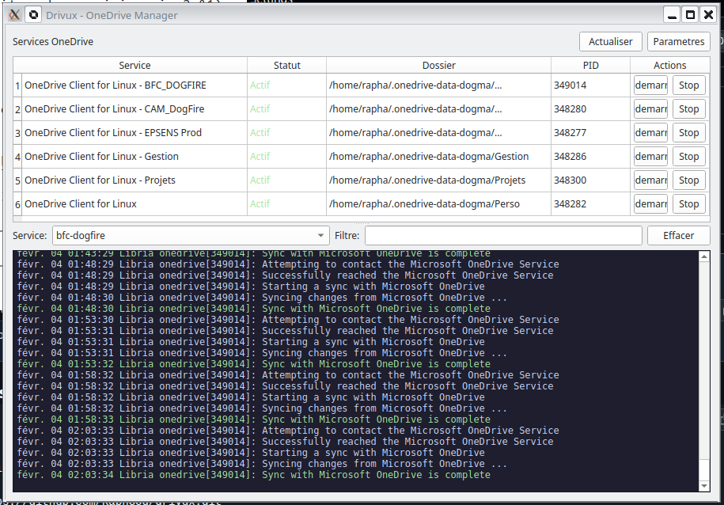

<p align="center">
  
</p>

<h1 align="center">Drivux</h1>

<p align="center">
  <strong>GUI manager for the <a href="https://github.com/abraunegg/onedrive">OneDrive Linux client</a></strong><br>
  Monitor, configure and control OneDrive sync services from your system tray.
</p>

<p align="center">
  <a href="https://github.com/RaphGod/drivux/blob/main/LICENSE"></a>
  
  
  
</p>

<p align="center">
  <a href="README.md">English</a> | <a href="docs/README_FR.md">Fran&ccedil;ais</a>
</p>

<details>
<summary>🌍 Available in your language / Disponible dans votre langue</summary>

<br>

| | Language | Description |
|---|---------|------------|
| 🇬🇧 | **English** | GUI manager for OneDrive on Linux. Monitor, configure and control your sync services from the system tray. |
| 🇫🇷 | **Fran&ccedil;ais** | Gestionnaire graphique pour OneDrive sur Linux. Surveillez, configurez et controlez vos services de synchronisation depuis le systray. [Lire en fran&ccedil;ais](docs/README_FR.md) |
| 🇪🇸 | **Espa&ntilde;ol** | Gestor grafico para OneDrive en Linux. Supervise, configure y controle sus servicios de sincronizacion desde la bandeja del sistema. |
| 🇩🇪 | **Deutsch** | GUI-Manager fur OneDrive unter Linux. Uberwachen, konfigurieren und steuern Sie Ihre Synchronisierungsdienste uber das System-Tray. |
| 🇵🇹 | **Portugu&ecirc;s** | Gerenciador grafico para OneDrive no Linux. Monitore, configure e controle seus servicos de sincronizacao pela bandeja do sistema. |
| 🇷🇺 | **Русский** | Графический менеджер для OneDrive в Linux. Отслеживайте, настраивайте и управляйте сервисами синхронизации из системного трея. |
| 🇨🇳 | **中文** | Linux 上的 OneDrive 图形管理工具。通过系统托盘监控、配置和控制您的同步服务。 |
| 🇯🇵 | **日本語** | Linux 用 OneDrive GUI マネージャー。システムトレイから同期サービスの監視、設定、制御ができます。 |
| 🇮🇳 | **हिन्दी** | Linux पर OneDrive के लिए ग्राफिकल मैनेजर। सिस्टम ट्रे से अपनी सिंक सेवाओं की निगरानी, कॉन्फ़िगरेशन और नियंत्रण करें। |
| 🇰🇷 | **한국어** | Linux용 OneDrive GUI 관리자. 시스템 트레이에서 동기화 서비스를 모니터링, 구성 및 제어하세요. |
| 🇸🇦 | **العربية** | مدير رسومي لـ OneDrive على Linux. راقب وهيئ وتحكم في خدمات المزامنة من شريط النظام. |

</details>

---

## Why Drivux?

The [abraunegg/onedrive](https://github.com/abraunegg/onedrive) client for Linux is powerful but has no graphical interface. Managing multiple OneDrive/SharePoint libraries means juggling config files, systemctl commands and journalctl logs manually.

**Drivux** provides a simple system tray GUI that brings it all together:

- See at a glance if your sync is healthy or broken
- Read live logs without touching the terminal
- Edit config files without a text editor
- Start, stop or restart services with one click

## Features

| Feature | Description |
|---------|------------|
| **System tray icon** | Changes color based on sync status (green = OK, red = error, orange = syncing) |
| **Service dashboard** | Overview of all OneDrive instances with status, PID, sync directory |
| **Live log viewer** | Real-time colored logs with per-service filtering |
| **Config editor** | Edit any OneDrive config parameter from the GUI |
| **Service controls** | Start / stop / restart individual or all services |
| **Multi-instance** | Manages multiple OneDrive and SharePoint libraries simultaneously |
| **Desktop notifications** | Get notified on sync errors (DNS failures, big deletes, etc.) |

## Requirements

- Linux with **systemd**
- [abraunegg/onedrive](https://github.com/abraunegg/onedrive) installed and running as **systemd user services**
- Python 3.10+

## Installation

**One-line install** (recommended):

```bash
curl -sSL https://raw.githubusercontent.com/RaphGod/drivux/main/install.sh | bash
```

This will:
- Download Drivux to `~/.local/share/drivux`
- Set up a Python virtual environment with dependencies
- Create the `drivux` command in `~/.local/bin`
- Add Drivux to your application menu
- Optionally enable autostart at login

Then just run:
```bash
drivux
```

<details>
<summary>Manual installation</summary>

```bash
git clone https://github.com/RaphGod/drivux.git
cd drivux
python -m venv .venv
source .venv/bin/activate
pip install -e .
drivux
```

</details>

### Uninstall

```bash
curl -sSL https://raw.githubusercontent.com/RaphGod/drivux/main/uninstall.sh | bash
```

## How it works

Drivux is a **read/control layer** on top of the existing OneDrive client. It does **not** replace or modify the client itself.

```
Drivux (GUI)
    |
    +-- systemctl --user    --> manage services
    +-- journalctl --user   --> stream live logs
    +-- ~/.config/onedrive* --> read/write config files
    |
OneDrive client (abraunegg)
    |
Microsoft OneDrive / SharePoint
```

## Contributing

Contributions are welcome! Feel free to open issues or pull requests.

## Sponsors

<a href="https://dogma.fr">
  
</a>

Drivux is developed and maintained by [Dogma](https://dogma.fr), a French IT consulting company.

## License

[GPL-3.0](LICENSE)
